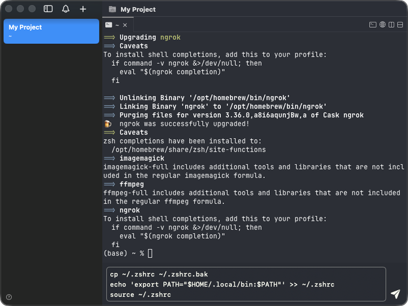
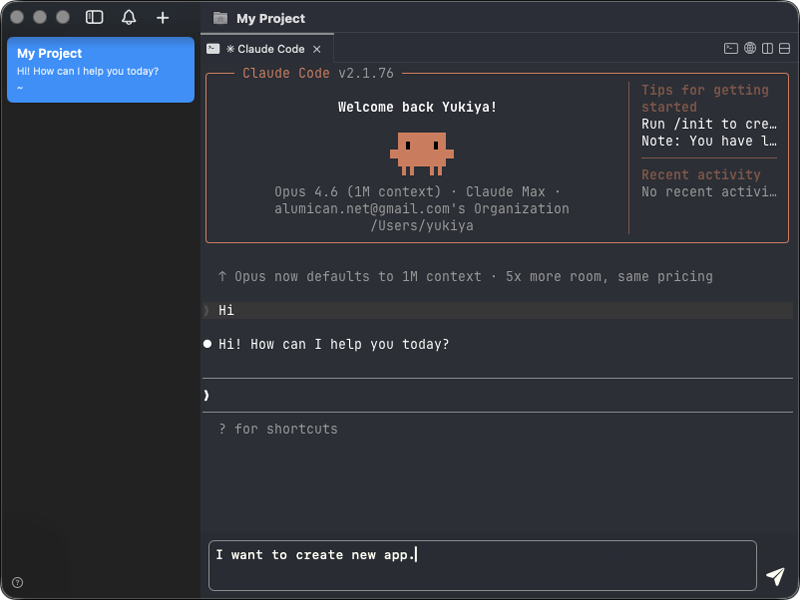
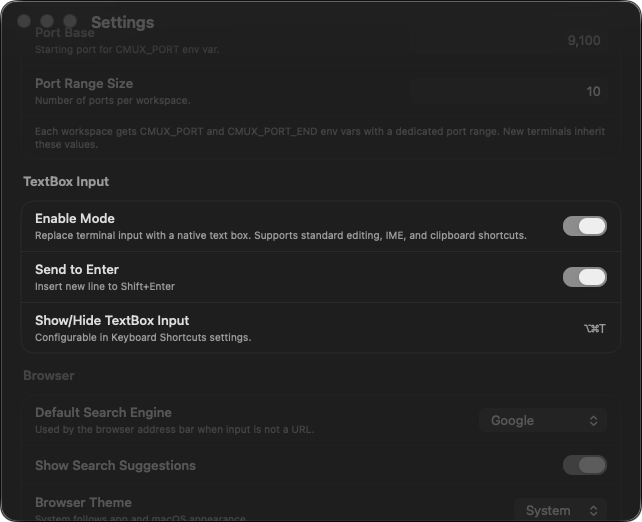

<h1 align="center">cmux + TextBox</h1>
<p align="center">A fork of <a href="https://github.com/manaflow-ai/cmux">cmux</a> with a built-in TextBox input mode</p>

<p align="center">
  <video src="./docs/assets/textbox-video.mp4" autoplay loop muted playsinline width="900"></video>
</p>

## Why TextBox?

Terminals weren't designed for writing long-form input. There's no easy way to go back and edit a previous line, selecting and cutting arbitrary ranges of text is cumbersome, and multi-line text requires awkward escapes or heredocs. For anyone used to normal text editors, this friction adds up fast.

TextBox adds a persistent input bar at the bottom of each terminal pane. It bridges the gap between a rich text editor and the raw terminal — two input modes that feel like one seamless experience.

- **When the TextBox is empty**, arrow keys, Tab, Backspace, and Ctrl shortcuts pass straight through to the terminal. It feels like you're typing directly into the shell.
- **When you're composing text**, it works like a familiar text editor — arrow keys navigate within your draft, and multi-line editing just works. Press Return (or click the send button) to submit.

No mode switching. No mental overhead. You type, and the right thing happens.

## Features

<table>
<tr>
<td width="40%" valign="middle">
<h3>Seamless input</h3>
When the TextBox is empty, arrow keys, Backspace, and other keys control the terminal directly.
</td>
<td width="60%">
<video src="./docs/assets/textbox-video.mp4" autoplay loop muted playsinline width="100%"></video>
</td>
</tr>
<tr>
<td width="40%" valign="middle">
<h3>Show / Hide</h3>
Toggle the TextBox on and off anytime with a keyboard shortcut.
</td>
<td width="60%">

</td>
</tr>
<tr>
<td width="40%" valign="middle">
<h3>Multi-line editing</h3>
Edit shell commands like a normal text editor — arrow keys, selection, copy/paste all work as expected.
</td>
<td width="60%">

</td>
</tr>
<tr>
<td width="40%" valign="middle">
<h3>AI agent friendly</h3>
Compose long prompts for Claude Code or other AI agents without fighting the terminal input.
</td>
<td width="60%">

</td>
</tr>
<tr>
<td width="40%" valign="middle">
<h3>Settings</h3>
Configure Send on Return, Show/Hide shortcut, and more from the settings panel.
</td>
<td width="60%">

</td>
</tr>
<tr>
<td colspan="2">
<h3>Ctrl shortcuts</h3>
Ctrl+C, Ctrl+D, and other control sequences are forwarded to the terminal even while the TextBox is focused.
</td>
</tr>
<tr>
<td colspan="2">
<h3>Send on Return</h3>
Choose whether Return sends text immediately or inserts a newline (Shift+Return for the other).
</td>
</tr>
</table>

## Install

This is a development fork. Clone and build from source:

```bash
git clone --recurse-submodules https://github.com/<your-username>/cmux.git
cd cmux
./scripts/setup.sh
./scripts/reload.sh --tag textbox
```

## Keyboard Shortcuts

### TextBox

| Shortcut | Action |
|----------|--------|
| ⌘ ⌥ T (Cmd + Option + T) | Toggle TextBox on/off |
| Return | Send text to terminal (when Send on Return is enabled) |
| ⌥ Return (Option + Return) | Insert newline (when Send on Return is enabled) |
| Escape | Return focus to terminal |

All standard cmux shortcuts continue to work. See the [cmux README](https://github.com/manaflow-ai/cmux#keyboard-shortcuts) for the full list.

## Settings

| Setting | Default | Description |
|---------|---------|-------------|
| Enabled | On | Show the TextBox input bar |
| Send on Return | Off | Return key sends text (instead of inserting a newline) |

## License

Same as cmux — [AGPL-3.0-or-later](LICENSE).
