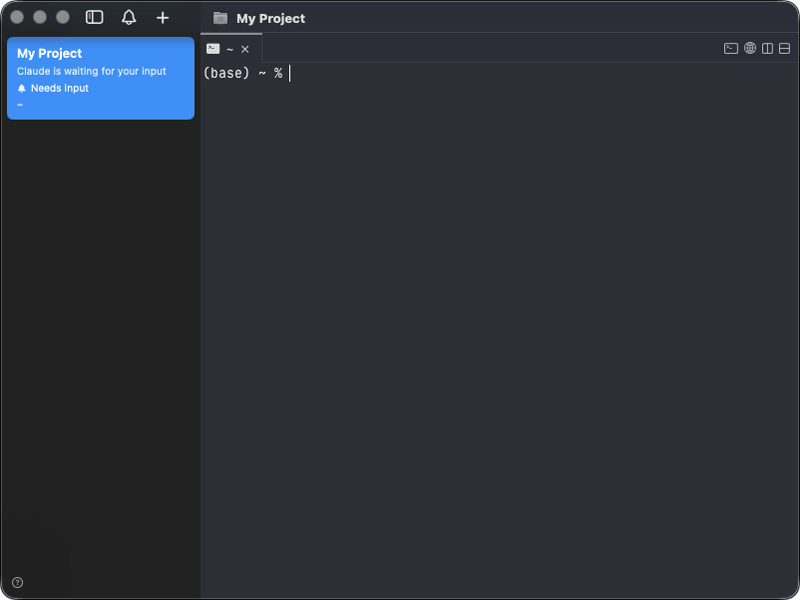
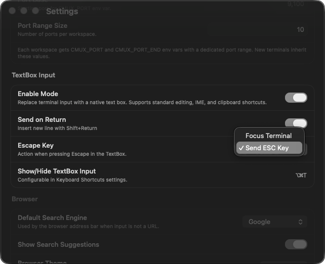

<h1 align="center">cmux + TextBox</h1>
<p align="center">A fork of <a href="https://github.com/manaflow-ai/cmux">cmux</a> with a built-in TextBox input mode</p>

<p align="center">
  <a href="https://github.com/alumican/cmux-tb/releases/latest/download/cmux-tb-macos.dmg">
    
  </a>
</p>

<p align="center">
  English | <a href="README.ja.md">日本語</a>
</p>

<p align="center">
  <video src="https://github.com/user-attachments/assets/9e83cc01-97a2-4c06-90cd-1c98422e9f3a" autoplay loop muted playsinline></video>
</p>

## Why TextBox?

If you're used to a normal text editor, typing in a terminal can feel surprisingly awkward. Line breaks, selection, cut & paste — things you do without thinking — just don't work the way you expect.

With this TextBox-enabled terminal, just type what you want. The standard terminal input is still there too, of course.

Two input modes sounds complicated? Don't worry — careful interaction design blends the boundary between them, so it all feels natural.

## Features

<table>
<tr>
<td width="40%" valign="middle">
<h3>Seamless and modeless</h3>
When the TextBox is empty, arrow keys, Tab, and Backspace pass through to the terminal.
<br/>
<br/>
Ctrl+key combinations (Ctrl+C, Ctrl+D, Ctrl+Z, etc.) and Escape are always forwarded regardless of content.
</td>
<td width="60%">
<video src="https://github.com/user-attachments/assets/f305e06e-a55e-4477-93f2-11d3bd17d03a" autoplay loop muted playsinline width="100%"></video>
</td>
</tr>
<tr>
<td width="40%" valign="middle">
<h3>Ready when you need it</h3>
Toggle the TextBox with a shortcut — focus moves smoothly between the input bar and terminal, so you can start typing right away.
</td>
<td width="60%">

</td>
</tr>
<tr>
<td width="40%" valign="middle">
<h3>Familiar editing</h3>
The TextBox uses your OS-native text input. Arrow keys, selection, copy & paste — the same operations you're used to, just working.
</td>
<td width="60%">
<video src="https://github.com/user-attachments/assets/a7777bfa-f63f-4273-bf5a-2778bea643dd" autoplay loop muted playsinline width="100%"></video>
</td>
</tr>
<tr>
<td width="40%" valign="middle">
<h3>Great with Claude Code</h3>
Launch an agent, edit prompts, reply to questions, interrupt a task — all without leaving the TextBox. Works with other terminal agents too, of course.
</td>
<td width="60%">
<video src="https://github.com/user-attachments/assets/69e0cea8-c975-49b3-87cc-711cf64b2ff4" autoplay loop muted playsinline width="100%"></video>
</td>
</tr>
<tr>
<td width="40%" valign="middle">
<h3>Settings</h3>
Send on Return or Shift+Return? What should ESC do? Customize it to fit your workflow.
</td>
<td width="60%">

</td>
</tr>
</table>

## Install

### DMG (recommended)

<a href="https://github.com/alumican/cmux-tb/releases/latest/download/cmux-tb-macos.dmg">
  
</a>

Open the `.dmg` and drag cmux to your Applications folder.

### Build from source

```bash
git clone --recurse-submodules https://github.com/alumican/cmux-tb.git
cd cmux
./scripts/setup.sh
./scripts/reload.sh --tag textbox
```

## Keyboard Shortcuts

### TextBox

| Shortcut | Action |
|----------|--------|
| ⌘ ⌥ T (Cmd + Option + T) | Show/Hide TextBox (configurable) |
| Return | Send text to terminal (swappable with Shift+Return) |
| ⇧ Return (Shift + Return) | Insert newline (swappable with Return) |
| ESC | Focus terminal or send ESC key (configurable) |

All standard cmux shortcuts continue to work. See the [cmux README](https://github.com/manaflow-ai/cmux#keyboard-shortcuts) for the full list.

## Settings

| Setting | Default | Description |
|---------|---------|-------------|
| Enable Mode | On | Enable TextBox input |
| Send on Return | On | Return sends text, Shift+Return inserts newline (swap when off) |
| Escape Key | Send ESC Key | Action when pressing ESC (Focus Terminal / Send ESC Key) |
| Show/Hide TextBox Input | ⌘⌥T | Keyboard shortcut to toggle TextBox |

## License

Same as cmux — [AGPL-3.0-or-later](LICENSE).
